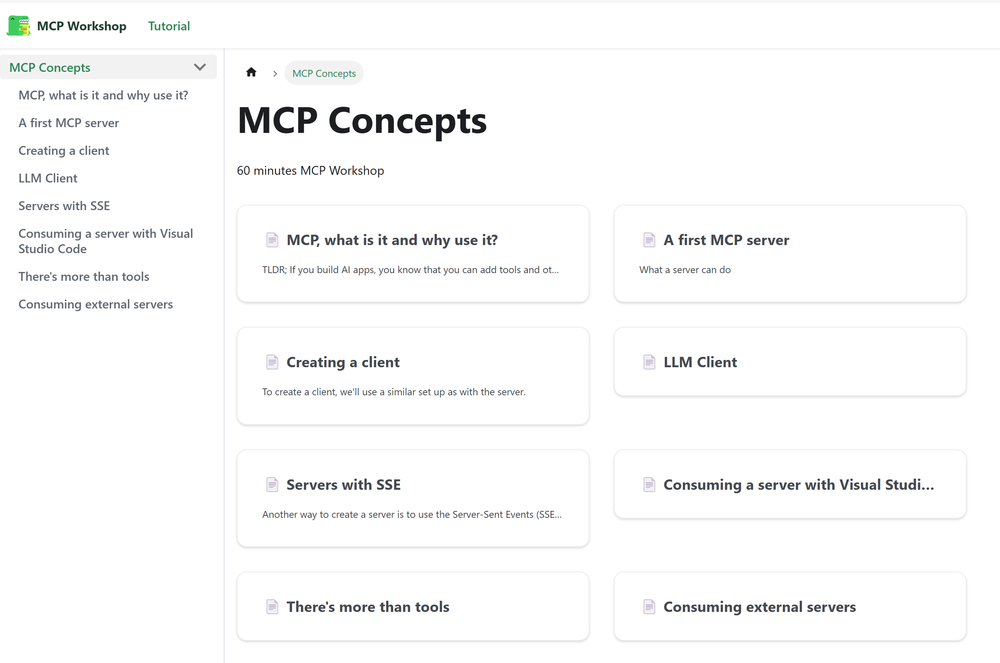

# MCP Workshop

🎉 Welcome to the MCP Workshop! 🚀

In this workshop, you'll dive into the exciting world of **Model Context Protocol (MCP)**. Whether you're a beginner or an experienced developer, there's something here for everyone! 🧑‍💻✨

## What You'll Learn 📚

- The fundamentals of MCP and why it's awesome! 🌟
- How to build and integrate MCP into your projects. 🔧
- Hands-on exercises to solidify your understanding. 💪

## Why Join? 🤔

- Collaborate with like-minded developers. 🤝
- Gain practical skills you can use right away. 🛠️
- Have fun while learning something new! 🎈

Get ready to level up your skills and have a blast! 🎉

## To the workshop! 💻

Navigate to the [workshop directory](https://softchris.github.io/mcp-workshop/docs/mcp-concepts/mcp-concepts)
️

---
Let’s get started! 🚀